# Hệ thống Chấm Điểm Tự động Bài Viết Tiếng Anh (Essay Scoring System)

Đây là phần Backend được xây dựng bằng **AWS SAM (Serverless Application Model)** và **Java 17**, giúp tự động chấm điểm bài viết tiếng Anh sử dụng AI (Google Gemini 1.5 Flash).

## 👥 Quy Tắc Làm Việc Nhóm

### Branching Strategy
- **main**: Chứa code ổn định, deploy lên Production
- **develop**: Chứa code mới nhất cho môi trường Dev
- **feature/<ten-tinh-nang>**: Tạo từ develop để làm tính năng mới (ví dụ: `feature/get-presigned-url`)
- **bugfix/<ten-bug>**: Từ develop để fix bug
- **Pull Request (PR)**: Yêu cầu review trước khi merge vào develop, cần ít nhất 1 approval

### Quy Tắc Commit
- Dùng prefix rõ ràng: `feat:`, `fix:`, `docs:`, `refactor:`, `test:`, `chore:`
- Ví dụ: `feat: add create essay API endpoint`

---

## 🏗️ Kiến trúc hệ thống

Hệ thống sử dụng kiến trúc Serverless với các dịch vụ AWS sau:
- **Amazon Cognito**: Xác thực người dùng
- **Amazon API Gateway**: REST API
- **AWS Lambda**: Xử lý logic nghiệp vụ (4 functions)
- **Amazon S3**: Lưu trữ file bài viết gốc và kết quả
- **Amazon SQS**: Hàng đợi tin nhắn
- **AWS Step Functions**: Orchestration workflow
- **Amazon Textract**: Trích xuất văn bản từ file
- **Amazon DynamoDB**: Lưu trữ dữ liệu bài viết
- **Amazon SNS**: Gửi thông báo email
- **AWS Systems Manager Parameter Store**: Lưu trữ API Key an toàn

- **AWS Systems Manager Parameter Store**: Lưu trữ API Key an toàn

## 🔄 Quy Trình Nghiệp Vụ Toàn Diện (System Workflows)

Dự án hoạt động dựa trên sự phối hợp chặt chẽ giữa 3 thành phần chính: **Frontend (React + Vite)**, **Backend Serverless (AWS SAM + Java)** và **AI Engine (Gemini 1.5 Flash)**. Quy trình nghiệp vụ chi tiết được thực hiện qua các bước dưới đây:

### 1. Sơ đồ tuần tự xử lý (Sequence Diagram)

```mermaid
sequenceDiagram
    autonumber
    actor User as Người dùng
    participant FE as React Frontend
    participant APIGW as API Gateway
    participant Cognito as AWS Cognito
    participant Lambda as AWS Lambda
    participant S3 as S3 Bucket
    participant SQS as SQS Queue
    participant StepFunc as AWS Step Functions
    participant Textract as AWS Textract
    participant DynamoDB as DynamoDB
    participant Gemini as Google Gemini API
    participant SNS as AWS SNS (Email)

    User->>FE: Đăng nhập (testuser@gmail.com / MatKhauChauAu123!)
    FE->>Cognito: Xác thực & lấy ID Token
    Cognito-->>FE: Trả về Token hợp lệ (hoặc Mock Token chế độ local)
    
    User->>FE: Kéo thả/Tải lên file bài viết (.txt)
    FE->>APIGW: POST /presigned-url (Yêu cầu URL tải lên)
    APIGW->>Lambda: Chạy GetPresignedUrl Lambda
    Lambda-->>FE: Trả về S3 Presigned URL bảo mật
    
    FE->>S3: PUT file trực tiếp lên S3 Raw Bucket (tránh giới hạn payload API GW)
    S3-->>FE: Xác nhận upload thành công (fileKey)
    
    FE->>APIGW: POST /essays (Đăng ký thông tin bài viết)
    APIGW->>Lambda: Chạy RouterStore Lambda
    Lambda->>DynamoDB: Lưu bản ghi bài viết với status = 'PROCESSING'
    Lambda->>SQS: Đưa tin nhắn xử lý vào hàng đợi (essay-scoring-queue)
    Lambda-->>FE: Trả về thông tin bản ghi ban đầu
    
    Note over SQS,StepFunc: Kích hoạt luồng bất đồng bộ (Asynchronous)
    SQS->>Lambda: JobStarter Lambda đọc tin nhắn từ hàng đợi
    Lambda->>StepFunc: Kích hoạt State Machine (Workflow chấm điểm)
    
    rect rgb(30, 41, 59)
        Note over StepFunc,Gemini: Step Functions Orchestration Workflow
        StepFunc->>Textract: Gửi fileKey để trích xuất văn bản (detectDocumentText)
        Textract-->>StepFunc: Trả về chuỗi văn bản gốc trích xuất từ tài liệu
        StepFunc->>Lambda: Chạy AiEvaluator Lambda (kèm văn bản gốc)
        Lambda->>Gemini: Gửi Prompt chuyên sâu chấm điểm (IELTS Rubrics)
        Gemini-->>Lambda: Trả về Score (70-90) & Feedback (Markdown)
        Lambda->>S3: Lưu kết quả chi tiết (.json) lên S3 Result Bucket
        Lambda->>DynamoDB: Cập nhật bản ghi (status = 'COMPLETED', score, feedback)
        Lambda->>SNS: Phát tin nhắn hoàn tất chấm điểm
        SNS-->>User: Gửi email thông báo điểm thi
    end
    
    loop Polling (Mỗi 5 giây)
        FE->>APIGW: GET /essays hoặc GET /essays/{id}
        APIGW->>Lambda: RouterStore Lambda đọc dữ liệu từ DynamoDB
        DynamoDB-->>FE: Trả về trạng thái hiện tại (PROCESSING -> COMPLETED)
    end
    
    FE->>User: Hiển thị điểm số & Phân tích biểu đồ Rubrics trên giao diện
```



---

### 2. Chi tiết nghiệp vụ từng thành phần

#### A. Frontend (React + Vite)
*   **Xác thực người dùng:** Tích hợp với **AWS Cognito** quản lý vòng đời User. Có cơ chế **Mock Bypass tự động** trong môi trường Dev giúp nhà phát triển đăng nhập nhanh bằng tài khoản test mà không cần kết nối Cognito.
*   **Tránh thắt nút cổ chai (Payload Limit Bypass):** Thay vì gửi trực tiếp nội dung file qua API Gateway (bị giới hạn 10MB và tốn băng thông Lambda), Frontend sử dụng cơ chế sinh **S3 Presigned URL** của AWS để tải file trực tiếp lên S3 dưới dạng Binary cực kỳ tối ưu và bảo mật.
*   **Trải nghiệm người dùng động (UX/UI):**
    *   Sử dụng cơ chế **Polling (Truy vấn lặp)** 5 giây một lần để theo dõi tiến trình chấm bài bất đồng bộ từ Backend.
    *   Tự động phân tích (parse) văn bản nhận xét từ AI bằng Regular Expression để tách ra các điểm số thành phần và vẽ thành biểu đồ cột năng lực trực quan (**Task Achievement**, **Coherence & Cohesion**, **Lexical Resource**, **Grammatical Range & Accuracy**).
*   **Cơ chế Mock DB Local dự phòng:** Nếu không tìm thấy cấu hình AWS hoặc API local ngoại tuyến, Frontend sẽ tự động chuyển sang chế độ chạy trên **LocalStorage Mock DB** giả lập đầy đủ quy trình tải lên, chờ chấm điểm (3.5 giây) và sinh kết quả chấm ngẫu nhiên để phục vụ demo nhanh.

#### B. Backend (AWS SAM + Java 17)
*   **GetPresignedUrl Lambda:** Tạo URL có thời hạn (thường là 15 phút) giúp Frontend tải file lên S3 an toàn, hạn chế tối đa nguy cơ lộ AWS credentials.
*   **RouterStore Lambda:** Đóng vai trò REST Controller quản lý API CRUD bài viết, ghi nhận thông tin vào DynamoDB và đẩy tác vụ chấm điểm vào hàng đợi SQS để xử lý bất đồng bộ, giúp API luôn phản hồi nhanh dưới 100ms.
*   **JobStarter Lambda:** Đọc tin nhắn từ SQS để kích hoạt Step Functions State Machine, đóng vai trò giảm tải áp lực (Rate Limiter) nhờ cơ chế hàng đợi.
*   **AWS Step Functions (Orchestration):** Điều phối luồng xử lý tuần tự từ trích xuất chữ viết (Amazon Textract) đến đóng gói dữ liệu và gọi AI chấm điểm, giúp xử lý lỗi (Retry/Catch) dễ dàng cho từng bước mà không cần code cứng trong Lambda.
*   **AiEvaluator Lambda:** 
    *   Lấy API Key của Gemini an toàn từ **AWS System Manager (SSM) Parameter Store** bằng kiểu dữ liệu mã hóa `SecureString`.
    *   Tổng hợp dữ liệu bài viết, đóng gói prompt chấm điểm tiếng Anh chuẩn giáo dục và tương tác với Gemini API.
    *   Cập nhật kết quả chấm vào cơ sở dữ liệu DynamoDB và lưu trữ file báo cáo tĩnh lên S3.
*   **AWS SNS:** Gửi thông báo Email tự động cho thí sinh khi bài luận của họ có kết quả chấm điểm từ hệ thống.

#### C. Trí tuệ nhân tạo (AI Engine - Google Gemini 1.5 Flash)
*   **Prompt Engineering chuyên biệt:** Hệ thống áp dụng cấu trúc Prompt thiết kế riêng cho mục đích giáo dục, yêu cầu mô hình AI đánh giá bài viết dựa trên **4 tiêu chí cốt lõi của IELTS Writing Task 2**:
    1.  **Task Achievement (Hoàn thành nhiệm vụ):** Đánh giá mức độ trả lời đầy đủ câu hỏi và phát triển lập luận.
    2.  **Coherence & Cohesion (Mạch lạc & Liên kết):** Kiểm tra tính liên kết giữa các câu, sự logic của các đoạn văn.
    3.  **Lexical Resource (Vốn từ vựng):** Đánh giá mức độ phong phú và chính xác của từ vựng học thuật.
    4.  **Grammatical Range & Accuracy (Ngữ pháp đa dạng & Chính xác):** Kiểm tra lỗi ngữ pháp và việc sử dụng linh hoạt các câu phức.
*   **Định dạng phản hồi có cấu trúc:** Gemini được yêu cầu trả về phản hồi theo định dạng Markdown có cấu trúc cụ thể (bao gồm điểm số thành phần dạng `Score: X/10` và nhận xét chi tiết từng phần) để giúp thuật toán Frontend dễ dàng bóc tách dữ liệu và vẽ biểu đồ.

---

## 📂 Cấu trúc thư mục

```
backend/
├── get-presigned-url/          # Lambda tạo Presigned URL upload file lên S3
│   ├── pom.xml
│   └── src/main/java/com/essayscoring/GetPresignedUrlHandler.java
├── router-store/               # Lambda quản lý API và DynamoDB
│   ├── pom.xml
│   └── src/main/java/com/essayscoring/RouterStoreHandler.java
├── job-starter/                # Lambda kích hoạt Step Functions từ SQS
│   ├── pom.xml
│   └── src/main/java/com/essayscoring/JobStarterHandler.java
├── ai-evaluator/               # Lambda gọi Gemini API để chấm điểm
│   ├── pom.xml
│   └── src/main/java/com/essayscoring/AiEvaluatorHandler.java
├── template.yaml               # Template SAM định nghĩa tất cả resources
├── state-machine.asl.json      # Định nghĩa workflow Step Functions
├── .gitignore                  # File ignore cho Git
└── README.md                   # File này
```

---

## 🛠️ Cài Đặt Môi Trường Dev

### Yêu cầu tiên quyết
- **Java 17**: [Tải về](https://adoptium.net/temurin/releases/?version=17)
- **Maven 3.9+**: [Tải về](https://maven.apache.org/download.cgi)
- **AWS CLI**: [Cài đặt](https://docs.aws.amazon.com/cli/latest/userguide/getting-started-install.html)
- **AWS SAM CLI**: [Cài đặt](https://docs.aws.amazon.com/serverless-application-model/latest/developerguide/install-sam-cli.html)

### Cấu hình AWS Credentials
```bash
aws configure
# Nhập Access Key ID, Secret Access Key, Region (vd: us-east-1), Output format: json
```

### Build dự án local
```bash
# Di chuyển vào backend
cd backend/

# Build toàn bộ module
mvn clean install
```

---

## 🚀 Hướng dẫn Deploy

### 1. Tạo SSM Parameter cho Gemini API Key
Trước khi deploy, tạo parameter trên AWS Systems Manager:
1. Mở AWS Console → **Systems Manager** → **Parameter Store**
2. **Create parameter**
3. Name: `/essay-scoring/gemini-api-key`
4. Type: **SecureString**
5. Value: Nhập Gemini API Key của bạn
6. **Create parameter**

### 2. Deploy lên Môi trường Dev
```bash
# Di chuyển vào backend
cd backend/

# Build
sam build

# Deploy (chỉ cần chạy --guided lần đầu)
sam deploy --guided --config-env dev
```

### 3. Deploy lên Môi trường Staging (QA)
```bash
sam deploy --config-env staging
```

### 4. Deploy lên Production
```bash
sam deploy --config-env prod
```

---

## 📝 Lệnh Thường Dùng

| Lệnh | Mô tả |
|------|-------|
| `mvn clean install` | Build toàn bộ module Java |
| `sam build` | Build SAM template |
| `sam deploy --config-env <dev/staging/prod>` | Deploy lên môi trường cụ thể |
| `sam local invoke <FunctionName>` | Test Lambda local |
| `sam local start-api` | Chạy API Gateway local |

---

## 🛠 Tech Stack

- **Ngôn ngữ**: Java 17
- **Framework**: AWS SAM (Serverless Application Model)
- **AWS Services**: Lambda, API Gateway, S3, SQS, SNS, DynamoDB, Step Functions, Textract, Cognito, Systems Manager
- **AI**: Google Gemini 1.5 Flash

---

## 📋 Môi Trường và Quy Trình CI/CD
- **Dev**: Tự động deploy khi merge vào develop
- **Staging**: Tự động deploy khi merge vào staging branch (QA test)
- **Prod**: Deploy thủ công khi merge vào main, cần approval
